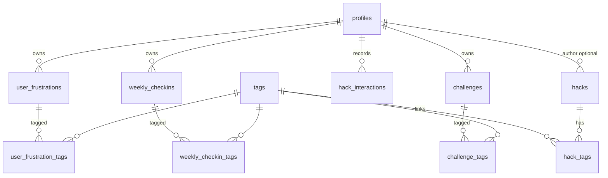
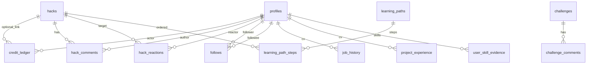

# Data model

Schemas live as SQL-first sources of truth:

| File | Purpose |
|------|---------|
| [supabase/schema.sql](../supabase/schema.sql) | Auth baseline: `profiles`, new-user trigger (run **first**) |
| [supabase/learning_schema.sql](../supabase/learning_schema.sql) | Learning MVP tables, RLS, `get_recommended_hacks()` |
| [supabase/ai_chat_schema.sql](../supabase/ai_chat_schema.sql) | AI onboarding/check-in transcripts, **`profile_understanding`**, **`user_interests`**, **`tag_suggestions`**, **`tags.capability`**; replaces **`get_recommended_hacks`** to include interests |

See also [decisions.md](decisions.md) for *why* (split files, ledger model, ESCO-ready tags).

---

## Current (learning MVP)

### Entities (Current)

| Entity / concept | Tables / artefact | Where in `learning_schema.sql` |
|------------------|-------------------|--------------------------------|
| User profile (+ sector/role fields) | `profiles` *(extended)* | §1 — ALTER `profiles` |
| Controlled vocabulary tags | `tags` | §2 |
| Published AI tips | `hacks` (+ `hack_tags`) | §3 |
| Problem statements during onboarding etc. | `user_frustrations` (+ `user_frustration_tags`) | §4 |
| Weekly snapshots | `weekly_checkins` (+ `weekly_checkin_tags`) | §5 |
| “Help me with X” quests | `challenges` (+ `challenge_tags`) | §6 |
| User ↔ hack signals | `hack_interactions` | §7 |
| Tag-overlap recommendation | `get_recommended_hacks(p_limit int)` SECURITY INVOKER | Bottom of file (~L546+); policies start at §“8. Row Level Security”. |

### Row Level Security (plain English)

- **Everyone signed in** can read **published** hacks and related join rows that are intentionally public-facing (exact rules in SQL policy names).
- **Users** can insert/select/update/delete **their own** frustrations, check-ins, challenges, interactions where policies say so — not other people’s rows.
- **Tags** — read for authenticated users; write reserved for **`curator` / `admin`** (controlled vocabulary).
- **Hacks** — read published for learners; **`creator`** can insert **`source = user`** hacks with **`author_id = auth.uid()`**; **`curator`/`admin`** can manage curated inserts (including **`author_id` null** paths as defined).
- Prefer reading the **`CREATE POLICY`** blocks starting around **`-- ─── 8. Row Level Security`** in [`learning_schema.sql`](../supabase/learning_schema.sql) before changing assumptions in app code.

---

## AI coach & interests *(run [`ai_chat_schema.sql`](../supabase/ai_chat_schema.sql) after learning_schema)*

| Entity / concept | Tables | Notes |
|------------------|--------|-------|
| Coach transcript | `chat_sessions`, `chat_messages` | `kind`: **onboarding** \| **checkin**; unique partial index: one **`open`** row per (`user_id`, `kind`). |
| Rolling memory | `profile_understanding` | **summary** + **signals** json; read into system prompt each request. |
| Interest weights | `user_interests` | `(user_id, tag_id)` PK; overlaps combined in **`get_recommended_hacks`**. |
| Vocabulary intake | `tag_suggestions` | Learner / LLM proposals; curators reconcile into **`tags`**. |
| Onboarding milestone | `profiles.onboarded_at` | Nullable timestamp written by **`finish_onboarding`** tool path. |

`get_recommended_hacks()` is **`CREATE OR REPLACE`**’d here to UNION **`user_interests.tag_id`** into the overlap set.

---

## Planned (B2B-MVP — schema deltas being scoped)

These are **decided but not yet migrated**. They are tracked in [decisions.md](decisions.md) (B2B SaaS, post types, taxonomy, challenge answers, praise→points, external sources) and [roadmap.md](roadmap.md) (Next → Schema).

### New / changed columns

| Target | Change | Notes |
|--------|--------|-------|
| `profiles` | + `organization_id uuid references organizations(id)` | Tenant scope; required for B2B |
| `tags` | extend `kind` check with **`'capability'`** (**done** in **`ai_chat_schema.sql`**) — seed actual capability rows separately |
| `hacks` | + `post_type` enum `bite \| recipe \| guide \| external` | Effort/length classification |
| `hacks` | + `goal` enum `automate \| analyse \| generate \| organise \| communicate \| learn \| decide` | Structured taxonomy slot |
| `hacks` | extend `source` check with `'external'` | Plus required `source_url`, optional `external_author` (curator-only writes) |
| `hacks` | publish-time check: ≥1 `tags.kind='tool'` and ≥1 `tags.kind='capability'` linked | Enforce via trigger or RPC |

### New tables

| Table | Purpose |
|-------|---------|
| `organizations` | Tenant root: name, slug, plan, created_at |
| `organization_memberships` | Optional if a user can belong to >1 org later; otherwise `profiles.organization_id` is enough |
| `challenge_comments` | `(challenge_id, author_id, body_md, hack_id NULL, is_self_promotion bool)` |
| `hack_praises` | `(hack_id, user_id)` unique pair; one praise per user per hack |
| `comment_praises` | `(comment_id, user_id)` unique pair |
| `points_ledger` | Append-only: `(actor_id, delta, reason, target_kind, target_id, created_at)` — slim promotion of `credit_ledger` from `future_schema.sql` |

### RLS implications

- Most reads are gated by `profiles.organization_id = current_org()` (helper). Curated platform content is org-agnostic.
- Only `curator`/`admin` may insert/update `hacks WHERE source='external'`.
- Praise inserts must enforce `target.author_id <> user_id` (no self-praise) and idempotency via unique constraint.

---

## Future

All below are inside the **big comment** in [`future_schema.sql`](../supabase/future_schema.sql) — not applied to production DB yet.

| Sketch entity | Intended use | Where |
|---------------|--------------|--------|
| `credit_ledger` | Append-only balance events | future §“Append-only credits” |
| `hack_comments`, `challenge_comments` | Discussion threads | future §comments |
| `hack_reactions` | Lightweight liking | future §Reactions |
| `follows` | Social graph | future §Follow graph |
| `learning_paths`, `learning_path_steps` | Curated sequences | future §paths |
| `job_history`, `project_experience` | Career corpus | future §Imported career |
| `user_skill_evidence` | Fine-grained skills + proof | future §ESCO-linked |

When any of these graduates to production, extend [`learning_schema.sql`](../supabase/learning_schema.sql) or add a numbered migration via Supabase CLI, update this doc, append an ADR to [decisions.md](decisions.md), and regenerate types.
