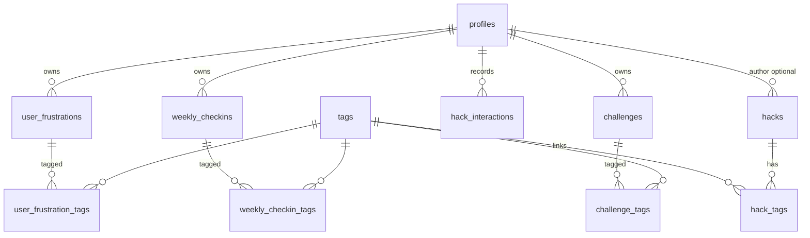
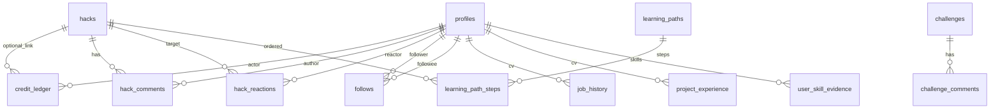

# Data model

Schemas live as SQL-first sources of truth:

| File | Purpose |
|------|---------|
| [supabase/schema.sql](../supabase/schema.sql) | Auth baseline: `profiles`, new-user trigger (run **first**) |
| [supabase/learning_schema.sql](../supabase/learning_schema.sql) | Learning MVP tables, RLS, `get_recommended_hacks()` |
| [supabase/ai_chat_schema.sql](../supabase/ai_chat_schema.sql) | AI onboarding/check-in transcripts, **`profile_understanding`**, **`user_interests`**, **`tag_suggestions`**, **`tags.capability`**; replaces **`get_recommended_hacks`** to include interests |
| [supabase/03_onboarding_extras.sql](../supabase/03_onboarding_extras.sql) | Adds **`profiles.linkedin_url`** captured by the AI coach (`record_linkedin` tool) |
| [supabase/05_recommendation_v2.sql](../supabase/05_recommendation_v2.sql) | **`get_recommended_hacks` v2**: tag overlap + helpful boost (+2) + viewed/completed decay (−0.5 / −1.0); excludes `not_helpful` |
| [supabase/06_hack_search.sql](../supabase/06_hack_search.sql) | **`hacks.search_tsv`** generated column (weighted: title=A, summary=B, body_md=C) + GIN index + **`find_hacks(query, limit)`** RPC for Postgres FTS |
| [supabase/07_ask_session.sql](../supabase/07_ask_session.sql) | Extends **`chat_sessions_kind_check`** to allow `'ask'` — backs the rolling, never-closing Ask chat session (ADR 2026-05-27 — Ask is a rolling, never-closing chat session) |
| [supabase/04_delete_account.sql](../supabase/04_delete_account.sql) | Self-serve testing reset: **`delete_my_account()`** — deletes **`auth.users`** for the caller; cascades **`profiles`** and user-owned rows (see ADR 2026-05-27) |
| [supabase/08_seed_dummy_posts.sql](../supabase/08_seed_dummy_posts.sql) | Idempotent seed: 10 curated `hacks` rows + sector/tool tags + `hack_tags` links. Hardcoded UUIDs (`aaaaaaaa-0001-0001-0001-00000000000N`) mirror **`POST_META_BY_ID`** in [`lib/dummy/posts.ts`](../lib/dummy/posts.ts) so DB rows decorate with TS-only metadata (post type, minutes, author, peers, metrics) until the B2B schema deltas below land. See ADR 2026-05-28 — Dummy posts seeded as curated hacks. |
| [supabase/09_find_hacks_v2.sql](../supabase/09_find_hacks_v2.sql) | **`find_hacks` v2** (same signature): tier-1 tag-overlap on query tokens × `hack_tags`, tier-2 strict FTS (`websearch_to_tsquery`), tier-3 gated OR fallback with inline stop-word strip + sanitised `to_tsquery`. Recent-published fallback for empty / all-stop-word queries only; substantive no-match queries return an empty set. See ADR 2026-05-28 — `find_hacks` v2. |
| [supabase/10_brand_assets_storage.sql](../supabase/10_brand_assets_storage.sql) | Storage bucket **`brand-assets`** (public read) for post-card tool logos; colors live in [`lib/brands/manifest.ts`](../lib/brands/manifest.ts). See [design-system.md](design-system.md). |
| [supabase/11_post_maker.sql](../supabase/11_post_maker.sql) | **Post maker base.** Engagement ladder **`levels`** (capability flags, ≥4 seeded) + forge-proof **`user_xp`** (denormalized total) + append-only **`points_ledger`**; structured **`hacks`** columns (**`post_type`**, **`primary_tool_slug`**, **`estimated_minutes`**, **`goal`**); **`channels`** + **`hack_channels`** (seeded ~8); helper fns **`user_total_xp`** / **`user_level`** / **`user_can_create_hacks`**; SECURITY DEFINER **`publish_hack(...)`** (capability gate + atomic insert + tags + channels≥1 + 250 XP). See ADR 2026-06-24 — Post maker. |

See also [decisions.md](decisions.md) for *why* (split files, ledger model, ESCO-ready tags).

Alongside **`get_recommended_hacks`**, **`public.delete_my_account()`** is an app-invoked RPC: **SECURITY DEFINER**, executable by **`authenticated`** only, used from the dashboard “Delete my profile” flow.

---

## Current (learning MVP)

### Entities (Current)

| Entity / concept | Tables / artefact | Where in `learning_schema.sql` |
|------------------|-------------------|--------------------------------|
| User profile (+ sector/role fields) | `profiles` *(extended)* | §1 — ALTER `profiles` |
| Controlled vocabulary tags | `tags` | §2 |
| Published AI tips | `hacks` (+ `hack_tags`) | §3 |
| Problem statements during onboarding etc. | `user_frustrations` (+ `user_frustration_tags`) | §4 |
| Weekly snapshots | `weekly_checkins` (+ `weekly_checkin_tags`) | §5 |
| “Help me with X” quests | `challenges` (+ `challenge_tags`) | §6 |
| User ↔ hack signals | `hack_interactions` (kind: saved / viewed / completed / helpful / not_helpful) | §7. Drives v2 recommendation rank (see `supabase/05_recommendation_v2.sql`) and `/for-you` thumbs/save UI ([`components/feed/hack-card-actions.tsx`](../components/feed/hack-card-actions.tsx) + [`app/for-you/actions.ts`](../app/for-you/actions.ts)). |
| Tag-overlap recommendation | `get_recommended_hacks(p_limit int)` SECURITY INVOKER | Originally defined in `learning_schema.sql`, REPLACEd in `ai_chat_schema.sql` (adds `user_interests` overlap), REPLACEd again in `05_recommendation_v2.sql` (adds implicit-signal scoring). |

### Row Level Security (plain English)

- **Everyone signed in** can read **published** hacks and related join rows that are intentionally public-facing (exact rules in SQL policy names).
- **Users** can insert/select/update/delete **their own** frustrations, check-ins, challenges, interactions where policies say so — not other people’s rows.
- **Tags** — read for authenticated users; write reserved for **`curator` / `admin`** (controlled vocabulary).
- **Hacks** — read published for learners; **`creator`** can insert **`source = user`** hacks with **`author_id = auth.uid()`**; **`curator`/`admin`** can manage curated inserts (including **`author_id` null** paths as defined).
- Prefer reading the **`CREATE POLICY`** blocks starting around **`-- ─── 8. Row Level Security`** in [`learning_schema.sql`](../supabase/learning_schema.sql) before changing assumptions in app code.

---

## AI coach & interests *(run [`ai_chat_schema.sql`](../supabase/ai_chat_schema.sql) after learning_schema)*

| Entity / concept | Tables | Notes |
|------------------|--------|-------|
| Coach transcript | `chat_sessions`, `chat_messages` | `kind`: **onboarding** \| **checkin** \| **ask**; unique partial index: one **`open`** row per (`user_id`, `kind`). `ask` rows intentionally never transition to `completed`. |
| Rolling memory | `profile_understanding` | **summary** + **signals** json; read into system prompt each request. |
| Interest weights | `user_interests` | `(user_id, tag_id)` PK; overlaps combined in **`get_recommended_hacks`**. |
| Vocabulary intake | `tag_suggestions` | Learner / LLM proposals; curators reconcile into **`tags`**. |
| Onboarding milestone | `profiles.onboarded_at` | Nullable timestamp written by **`finish_onboarding`** tool path. |
| LinkedIn URL | `profiles.linkedin_url` | Normalized `https://www.linkedin.com/in/<vanity>/` from `record_linkedin` tool. Server-validated by [`lib/ai/linkedin.ts`](../lib/ai/linkedin.ts). Phase 2 will fetch the profile via Proxycurl when `PROXYCURL_API_KEY` is set. |
| Coverage helper | [`lib/ai/coverage.ts`](../lib/ai/coverage.ts) | Counts `sector`, `linkedin_url`, open frustrations, tool/capability interests (matched + proposed), and current-week check-in. Renders `CAPTURED_SO_FAR` / `AIM_FOR` blocks in the system prompt for onboarding / checkin only — **steering hints only, no hard gate** (ADR 2026-05-27 — Soft coverage hints). |
| Recent feedback digest | [`lib/ai/recent-feedback.ts`](../lib/ai/recent-feedback.ts) | Two-query helper that resolves last-14d `helpful` / `not_helpful` interactions to tag slugs + counts a 14d save streak. Rendered as `RECENT_FEEDBACK` only for `kind: 'ask'` (ADR 2026-05-27 — Ask system prompt carries last-14d feedback digest). |
| Hack view tracker | [`components/feed/hack-view-tracker.tsx`](../components/feed/hack-view-tracker.tsx) + `recordView` in [`app/for-you/actions.ts`](../app/for-you/actions.ts) | IntersectionObserver fires after ≥2s of card-in-viewport, inserting `hack_interactions(kind='viewed')`. PK conflict (`23505`) is treated as success — idempotent across renders (ADR 2026-05-27 — Auto-`viewed` via IntersectionObserver). |
| Ask zero-result pivot | `suggest_challenge` tool in [`lib/ai/tools.ts`](../lib/ai/tools.ts) | **No DB write.** Returns a deep-link `href` to [`/challenges/new`](../app/(app)/challenges/new/page.tsx) with pre-filled `title` / `body` / `tag` query params. Rendered as a CTA card via [`suggest-challenge-renderer.tsx`](../components/feed/suggest-challenge-renderer.tsx) (`AskNavigateProvider`); clicking animates the Ask overlay out (GSAP fade + slide) then routes. Challenge rows are created only when the user submits [`createChallenge`](../app/(app)/challenges/actions.ts) on the form (ADR 2026-05-27 — Ask coach pivots to Challenges on zero-result hacks). |
| Challenges surface | `challenges`, `challenge_tags` + [`app/(app)/challenges/`](../app/(app)/challenges/) | List (mine + open peers), create form, read-only detail. Writes via Server Action; comments/praise still planned (B2B-MVP wave). |

`get_recommended_hacks()` is **`CREATE OR REPLACE`**’d here to UNION **`user_interests.tag_id`** into the overlap set.

---

## Planned (B2B-MVP — schema deltas being scoped)

These are **decided but not yet migrated**. They are tracked in [decisions.md](decisions.md) (B2B SaaS, post types, taxonomy, challenge answers, praise→points, external sources) and [roadmap.md](roadmap.md) (Next → Schema).

> **Partially landed (ADR 2026-06-24 — Post maker, [`supabase/11_post_maker.sql`](../supabase/11_post_maker.sql)):** `hacks.post_type` + `hacks.goal` columns, a `points_ledger` (with forge-proof `user_xp` total), the `levels` engagement ladder, and `channels` + `hack_channels` now exist. Still pending below: `organizations` / `profiles.organization_id`, `hacks.source = 'external'` (+ `source_url`), praise tables, org-scoped RLS, and auto-promotion on level thresholds.

### New / changed columns

| Target | Change | Notes |
|--------|--------|-------|
| `profiles` | + `organization_id uuid references organizations(id)` | Tenant scope; required for B2B |
| `tags` | extend `kind` check with **`'capability'`** (**done** in **`ai_chat_schema.sql`**) — seed actual capability rows separately |
| `hacks` | + `post_type` enum `bite \| recipe \| guide \| external` | Effort/length classification |
| `hacks` | + `goal` enum `automate \| analyse \| generate \| organise \| communicate \| learn \| decide` | Structured taxonomy slot |
| `hacks` | extend `source` check with `'external'` | Plus required `source_url`, optional `external_author` (curator-only writes) |
| `hacks` | publish-time check: ≥1 `tags.kind='tool'` and ≥1 `tags.kind='capability'` linked | Enforce via trigger or RPC |

### New tables

| Table | Purpose |
|-------|---------|
| `organizations` | Tenant root: name, slug, plan, created_at |
| `organization_memberships` | Optional if a user can belong to >1 org later; otherwise `profiles.organization_id` is enough |
| `challenge_comments` | `(challenge_id, author_id, body_md, hack_id NULL, is_self_promotion bool)` |
| `hack_praises` | `(hack_id, user_id)` unique pair; one praise per user per hack |
| `comment_praises` | `(comment_id, user_id)` unique pair |
| `points_ledger` | Append-only: `(actor_id, delta, reason, target_kind, target_id, created_at)` — slim promotion of `credit_ledger` from `future_schema.sql` |

### RLS implications

- Most reads are gated by `profiles.organization_id = current_org()` (helper). Curated platform content is org-agnostic.
- Only `curator`/`admin` may insert/update `hacks WHERE source='external'`.
- Praise inserts must enforce `target.author_id <> user_id` (no self-praise) and idempotency via unique constraint.

### Surfaces blocked on this delta

The app shell ships their routes today but they render an EmptyState until the schema lands (see ADR 2026-05-27 — App shell via `(app)` route group + `AppHeader`):

- **`/office`** (Peers) — needs `profiles.organization_id` to scope the feed to the viewer's colleagues.
- **`/explore`** — needs the same `organization_id` column plus a hack-level public/private visibility flag (or the heuristic "platform-curated + external sources are always public, user-source defaults to org-private") so the cross-org filter can be expressed in RLS.

---

## Future

All below are inside the **big comment** in [`future_schema.sql`](../supabase/future_schema.sql) — not applied to production DB yet.

| Sketch entity | Intended use | Where |
|---------------|--------------|--------|
| `credit_ledger` | Append-only balance events | future §“Append-only credits” |
| `hack_comments`, `challenge_comments` | Discussion threads | future §comments |
| `hack_reactions` | Lightweight liking | future §Reactions |
| `follows` | Social graph | future §Follow graph |
| `learning_paths`, `learning_path_steps` | Curated sequences | future §paths |
| `job_history`, `project_experience` | Career corpus | future §Imported career |
| `user_skill_evidence` | Fine-grained skills + proof | future §ESCO-linked |

When any of these graduates to production, extend [`learning_schema.sql`](../supabase/learning_schema.sql) or add a numbered migration via Supabase CLI, update this doc, append an ADR to [decisions.md](decisions.md), and regenerate types.
